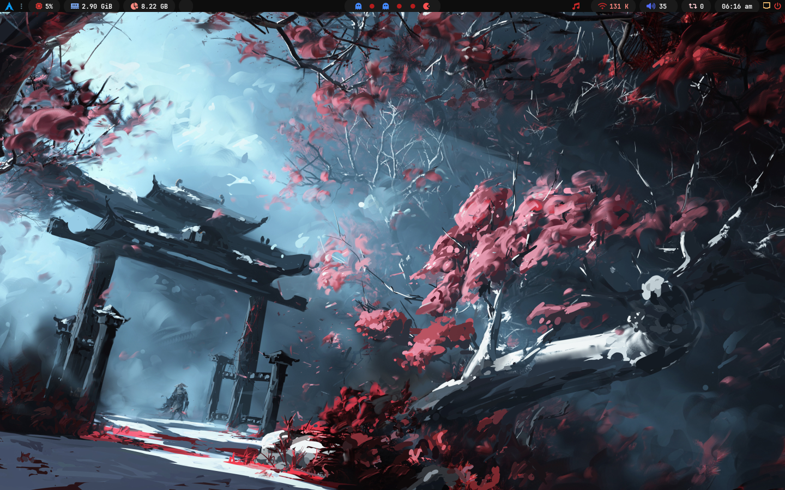

# 🔴 Demon Time

A dark red rice for [gh0stzk dotfiles](https://github.com/gh0stzk/dotfiles) based on the Emilia theme.

## Info

- **WM:** bspwm
- **Bar:** Polybar
- **Compositor:** Picom
- **Launcher:** Rofi
- **Notifications:** Dunst
- **Terminal:** Alacritty / Kitty
- **Resolution:** 1440x900

## Colors

| Color | Hex |
|-------|-----|
| Background | `#0d0d0d` |
| Foreground | `#f0f0f0` |
| Red | `#e53935` |
| Red Dark | `#8b0000` |
| Blue | `#448aff` |
| Cyan | `#40c4ff` |

## Install

This rice requires [gh0stzk dotfiles](https://github.com/gh0stzk/dotfiles) installed first.

\`\`\`bash
git clone https://github.com/metanonome/demon-time.git
cp -r demon-time ~/.config/bspwm/rices/medraz
\`\`\`

Then select **medraz** from the RiceSelector (right click on launcher).

## Credits

- Base: [gh0stzk](https://github.com/gh0stzk/dotfiles)
- Fork: [metanonome](https://github.com/metanonome)
